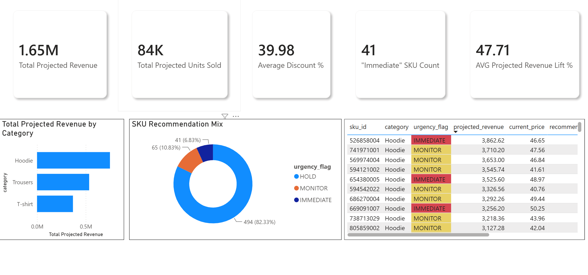
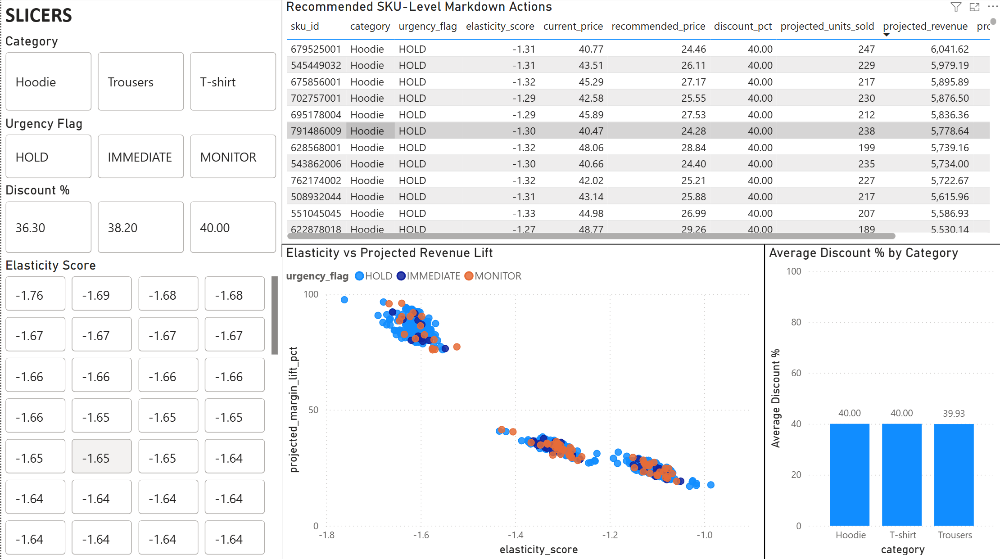

# Fashion Elasticity Engine

A retail pricing analytics and markdown decision-support project that estimates SKU-level price elasticity, identifies slow-moving inventory, and recommends markdown actions for apparel products.

This project is positioned as a **technology consulting + analytics** portfolio case study: it connects a business problem, an analytics pipeline, a database layer, and a Power BI dashboard design into one end-to-end decision engine.

## Business Problem

Fashion retailers frequently deal with excess inventory near the end of a product lifecycle. The business challenge is not simply deciding whether to discount products. The harder problem is deciding:

- Which SKUs should be marked down first?
- How deep should the markdown be?
- Which products should be held, monitored, or acted on immediately?
- What revenue impact should the business expect from each markdown recommendation?

Blanket discounting can damage margin and brand perception. This project uses product-level sales behavior to support more targeted markdown decisions.

## Solution Overview

The Fashion Elasticity Engine builds a structured analytics workflow that:

1. Creates a clean product and weekly price history dataset.
2. Calculates sales velocity and inventory aging indicators.
3. Estimates SKU-level price elasticity using log-log regression.
4. Tests markdown scenarios across discount levels.
5. Recommends a markdown price, projected units sold, projected revenue, and urgency flag.
6. Loads outputs into PostgreSQL tables for reporting.
7. Defines a Power BI dashboard for executive and SKU-level decisioning.

## Dashboard Preview

The Power BI dashboard translates the markdown engine outputs into an executive and category-manager decision tool.

### Executive Overview



This page summarizes projected markdown revenue, recommended discount depth, urgent SKU count, category-level opportunity, and recommendation mix.

### SKU Action Center



This page provides the SKU-level action list, including urgency flag, elasticity score, current price, recommended price, projected revenue, and recommended discount.

### Elasticity Analysis


This page explains model behavior across categories, including average elasticity, current vs. recommended prices, revenue trends, and sales velocity.

## Important Data Note

The project uses H&M-style product and transaction data as the base apparel dataset. Because the source data does not provide a complete historical markdown event table, the weekly pricing history is **simulated** using seeded price variation and category-level elasticity assumptions.

This is intentional. The goal is to demonstrate an end-to-end retail pricing analytics pipeline, not to claim production-grade causal price optimization. The project should be interpreted as a realistic decision-support prototype.

## Analytics Workflow

```text
Raw apparel product and transaction data
        ↓
Data exploration and SKU/category filtering
        ↓
Simulated weekly price history generation
        ↓
Sales velocity and inventory aging calculations
        ↓
SKU-level elasticity estimation
        ↓
Markdown scenario optimization
        ↓
PostgreSQL reporting tables
        ↓
Power BI dashboard design
```

## Key Outputs

The engine produces SKU-level markdown recommendations with the following outputs:

| Output | Description |
|---|---|
| `elasticity_score` | Estimated relationship between price changes and unit demand |
| `current_price` | Most recent observed or simulated price |
| `recommended_price` | Optimized markdown price |
| `discount_pct` | Recommended discount percentage |
| `projected_units_sold` | Estimated units sold under the recommended price |
| `projected_revenue` | Estimated revenue under the recommended price |
| `projected_margin_lift_pct` | Current project field for projected lift; should be interpreted as revenue/adjusted revenue lift unless cost data is added |
| `urgency_flag` | Action label: `HOLD`, `MONITOR`, or `IMMEDIATE` |

## Tech Stack

- **Python:** pandas, NumPy, statsmodels
- **Modeling:** log-log regression for price elasticity estimation
- **Database:** PostgreSQL, SQLAlchemy
- **SQL:** star-schema style reporting tables and analytical queries
- **BI Layer:** Power BI dashboard specification
- **Use Case:** retail markdown optimization, lifecycle pricing, inventory decision support

## Repository Structure

```text
fashion-elasticity-engine/
├── data/                         # Source and generated datasets
├── notebooks/                    # Exploratory analysis and price-history generation
├── scripts/                      # Pipeline scripts
│   ├── 01_velocity.py             # Sales velocity and inventory aging
│   ├── 02_elasticity.py           # SKU-level elasticity estimation
│   ├── 03_optimizer.py            # Markdown recommendation engine
│   ├── 04_load_to_postgres.py     # PostgreSQL loading script
│   └── 05_validate_outputs.py     # Data validation checks
├── sql/
│   ├── schema.sql                 # PostgreSQL table definitions
│   └── queries.sql                # Analytical SQL queries
├── docs/
│   ├── assumptions.md             # Modeling and business assumptions
│   └── powerbi_dashboard_spec.md  # Power BI dashboard design
├── requirements.txt
├── .env.example
└── README.md
```

## How to Run

### 1. Install dependencies

```bash
pip install -r requirements.txt
```

### 2. Generate or refresh pipeline outputs

Run the scripts from the `scripts/` directory or adjust paths based on your working directory.

```bash
python 01_velocity.py
python 02_elasticity.py
python 03_optimizer.py
python 05_validate_outputs.py
```

### 3. Load results into PostgreSQL

Create a local PostgreSQL database named `fashion_elasticity`, then configure your `.env` file using `.env.example` as a template.

```bash
python 04_load_to_postgres.py
```

### 4. Build the Power BI dashboard

Use the tables or CSV outputs described in `docs/powerbi_dashboard_spec.md`.

Recommended reporting tables:

- `dim_products`
- `fact_weekly_sales`
- `fact_markdown_recommendations`

## Business Interpretation

This project helps a retail stakeholder answer:

- Which products are underperforming relative to their category?
- Which products are old enough and slow enough to need markdown attention?
- How sensitive is each product to price changes?
- What markdown level produces the best projected revenue outcome?
- Which SKUs should be prioritized for immediate action?

## Portfolio Relevance

This project demonstrates skills relevant to technology consulting, business analyst, and data analyst roles:

- Translating an ambiguous retail pricing problem into an analytical solution
- Building a repeatable Python data pipeline
- Applying statistical modeling to a business decision
- Designing SQL tables for BI consumption
- Creating executive-ready dashboard requirements
- Communicating assumptions, limitations, and recommendations clearly

## Future Improvements

Potential next iterations:
- Create a Streamlit or web app interface for scenario testing.

## Resume Summary

Built a retail markdown optimization engine using Python, SQL, PostgreSQL, and Power BI concepts to estimate SKU-level price elasticity, identify slow-moving apparel inventory, and recommend markdown actions based on projected revenue impact and sell-through urgency.

Designed an executive Power BI dashboard for markdown decisioning, visualizing SKU urgency, recommended discounts, projected revenue lift, and category-level elasticity trends to support retail pricing strategy
